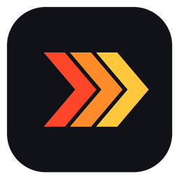
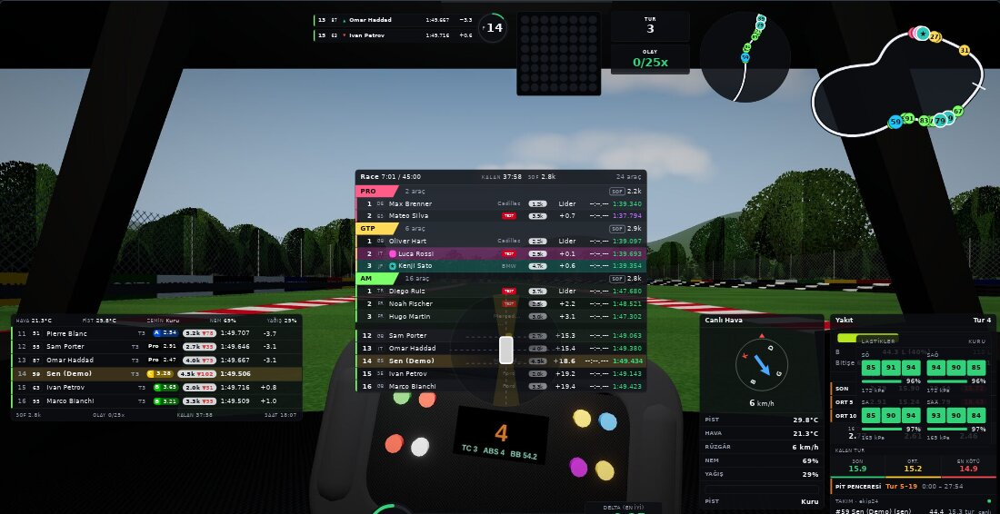
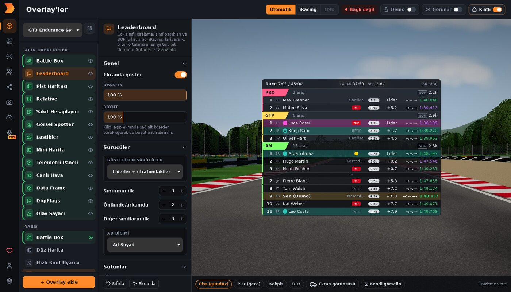

# SRTR Pitwall

### Всё для iRacing в одном приложении — оверлеи, споттер, стратегия, стриминг и сообщество в лёгкой и быстрой программе.

[English](../../README.md) · [Türkçe](README.tr.md) · [Deutsch](README.de.md) · [Español](README.es.md) · [Français](README.fr.md) · [Italiano](README.it.md) · [Português (BR)](README.pt-BR.md) · [Português (PT)](README.pt-PT.md) · [Nederlands](README.nl.md) · [Polski](README.pl.md) · [Svenska](README.sv.md) · [Suomi](README.fi.md) · **Русский** · [简体中文](README.zh-CN.md) · [日本語](README.ja.md)

[**⬇ Скачать последнюю версию**](../../../../releases/latest) · [**🌐 pitwall.simracetr.com**](https://pitwall.simracetr.com)

---

## Почему SRTR Pitwall?

Большинство программ ограничиваются оверлеями. SRTR Pitwall — это полноценный пит-уолл для вашего симрига:

- 🏎️ **27 оверлеев в одном прозрачном окне** — relative, таблица позиций, топливо, шины, радар, карта трассы, дельта, педали и руль, погода, флаги и многое другое. Всё отрисовывается в одном окне на каждый монитор, поэтому работает быстро даже с полной раскладкой.
- 🎙️ **Визуальный и голосовой споттер** — машина слева / справа, три в ряд, флаги, подсказки по топливу и позиции с турецким голосовым пакетом, а также предупреждения о более быстром классе и о возвращении на трассу.
- ⛽ **Топливная стратегия с обменом данными в команде** — расход за круг, объём дозаправки, пит-окна и топливо ваших напарников в реальном времени прямо в вашем оверлее.
- 👥 **Друзья и доверенная телеметрия в реальном времени** — добавляйте друзей, смотрите, кто онлайн или в гонке, и открывайте проверенным пилотам доступ к вашему топливу и данным по кругам. Никаких кодов и настроек.
- 💬 **Сообщения прямо в гонке** — сообщения от друзей всплывают на экране со звуком, пока вы едете. Режим «Не беспокоить» придержит их до возвращения в гараж.
- 📺 **Стрим-раскладки для OBS** — отдельные раскладки для трансляций, готовые сцены (скоро начнём, скоро вернусь, завершение, заставка гаража) и оверлей чата Twitch.
- 🌍 **Центр сообщества** — делитесь и скачивайте готовые раскладки, стрим-раскладки и цветовые темы со всеми настройками. Оценивайте, комментируйте и смотрите лучшее за месяц и за всё время.
- 📸 **Скриншоты одной клавишей** — Print Screen снимает игру *вместе* с оверлеями и водяным знаком, а затем их можно выложить в галерею сообщества.
- 🎨 **Движок тем** — шрифты, цвета, плотность, скругление углов, прозрачность и размер меняются сразу во всех оверлеях. Шесть встроенных тем плюс темы от сообщества.
- 🧩 **Менеджер раскладок** — автоматические раскладки для каждой машины и сессии, поддержка нескольких мониторов, направляющие с привязкой и живой предпросмотр на фоне реальных трасс.
- 🔄 **Подписанные автообновления** — новые версии устанавливаются в один клик и проверяются по нашему ключу подписи.
- 🌐 **15 языков** — English, Türkçe, Deutsch, Español, Français, Italiano, Português, Nederlands, Polski, Svenska, Suomi, Русский, 简体中文, 日本語.

## Создан для производительности

Ваши GPU и CPU нужны симулятору. SRTR Pitwall написан на **Rust** с интерфейсом на **SolidJS** поверх **Tauri 2**:

- Чтение телеметрии и все вычисления выполняются на Rust в одном фоновом потоке.
- Каждый оверлей получает только нужные ему данные и со своей частотой. Данные для закрытых оверлеев вообще не вычисляются.
- Когда iRacing не запущен, окно оверлеев полностью скрыто.
- Предпросмотры в панели управления — статичные снимки, поэтому они не нагружают CPU, пока вы с ними не взаимодействуете.
- Никакого размытия и постоянных анимаций: ничто не отнимает GPU у игры.

## Быстрый старт

1. Скачайте установщик в разделе [**Releases**](../../../../releases/latest) и установите его.
2. Запустите iRacing в режиме **окна без рамки / полноэкранного окна**. Windows не позволяет выводить оверлеи поверх эксклюзивного полноэкранного режима.
3. Оверлеи появляются автоматически при подключении iRacing. Включите переключатель **Demo**, чтобы настроить раскладку без iRacing.

| Сочетание клавиш | Действие |
|---|---|
| `Ctrl` + `Shift` + `E` | Редактировать раскладку (перетаскивание, изменение размера, правый клик — параметры) |
| `Ctrl` + `Shift` + `D` | Показать / скрыть оверлеи |
| `Ctrl` + `Shift` + `Space` | Вывести панель управления на передний план |
| `Print Screen` | Скриншот с оверлеями |

Все сочетания клавиш можно изменить в **Настройки → Сочетания клавиш**.

## Бесплатно и PRO

SRTR Pitwall полностью работает **без аккаунта**. Бесплатный аккаунт открывает доступ к сообществу, облачному резервному копированию настроек и списку друзей. **PRO** добавляет премиум-оверлеи, голосового инженера, доверенный обмен данными в реальном времени и отправку сообщений друзьям, публикацию и использование тем сообщества, а также использование, оценку и комментирование раскладок сообщества.

## Сообщество

Создано **Erkin Azcan** для сообщества [Sim Race Türkiye](https://www.simracetr.com).

[YouTube](https://www.youtube.com/@ErkinAzcan) · [Twitch](https://www.twitch.tv/erkinazcan) · [Kick](https://kick.com/erkinazcan) · [Instagram](https://www.instagram.com/erkinazcan) · [Steam](https://steamcommunity.com/id/erkinazcan/)

Нашли баг или есть идея? Создайте [issue](../../../../issues).

---

Документация для разработчиков (на турецком языке): [docs/GELISTIRME.md](../GELISTIRME.md) · Примечания к выпуску: [SURUM_NOTLARI.md](../../SURUM_NOTLARI.md) 
iRacing является товарным знаком iRacing.com Motorsport Simulations, LLC. SRTR Pitwall не связан с iRacing и не одобрен ею.
